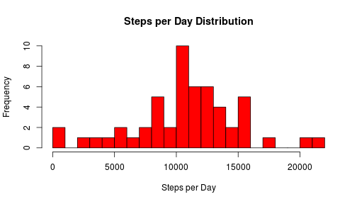
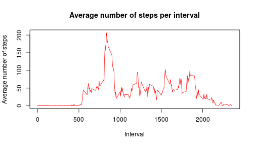
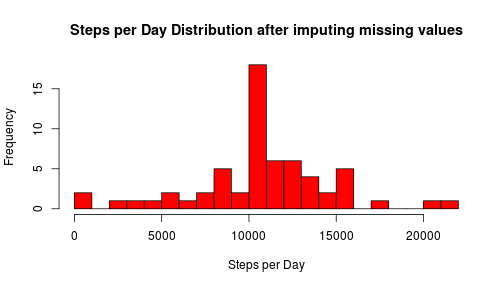

Reproducible Research - Peer Assesment 1
========================================================
#### *by Mauricio G. Melara Camargo*

### Introduction

It is now possible to collect a large amount of data about personal movement using activity monitoring devices such as a Fitbit, Nike Fuelband, or Jawbone Up. These type of devices are part of the “quantified self” movement – a group of enthusiasts who take measurements about themselves regularly to improve their health, to find patterns in their behavior, or because they are tech geeks. But these data remain under-utilized both because the raw data are hard to obtain and there is a lack of statistical methods and software for processing and interpreting the data.

This assignment makes use of data from a personal activity monitoring device. This device collects data at 5 minute intervals through out the day. The data consists of two months of data from an anonymous individual collected during the months of October and November, 2012 and include the number of steps taken in 5 minute intervals each day.

### Data

The data for this assignment can be downloaded from the course web site:

Dataset: [Activity monitoring data] (https://d396qusza40orc.cloudfront.net/repdata%2Fdata%2Factivity.zip) [52K]

The variables included in this dataset are:

**steps**: Number of steps taking in a 5-minute interval (missing values are coded as NA)

**date**: The date on which the measurement was taken in YYYY-MM-DD format

**interval**: Identifier for the 5-minute interval in which measurement was taken

### Loading and preprocessing the data

```r
data = read.csv("~/work/Coursera/Reproducible_Research/RepData_PeerAssessment1/activity.csv", 
    na.strings = "NA")
```


Let's take a quick load on the data format:

```r
str(data)
```

```
## 'data.frame':	17568 obs. of  3 variables:
##  $ steps   : int  NA NA NA NA NA NA NA NA NA NA ...
##  $ date    : Factor w/ 61 levels "2012-10-01","2012-10-02",..: 1 1 1 1 1 1 1 1 1 1 ...
##  $ interval: int  0 5 10 15 20 25 30 35 40 45 ...
```


The "date"" field is loaded as a factor, so let`s convert it to a Date format for later analysis:

```r
data[2] = as.Date(data[[2]])
```


### What is mean total number of steps taken per day?

```r
library(reshape2)
meltData <- melt(data, id = c("date"), measure.vars = c("steps"))
stepsPerDay <- dcast(meltData, date ~ ., sum)

## removing NA values
stepsPerDay <- stepsPerDay[!is.na(stepsPerDay[2]), ]
head(stepsPerDay)
```

```
##         date     .
## 2 2012-10-02   126
## 3 2012-10-03 11352
## 4 2012-10-04 12116
## 5 2012-10-05 13294
## 6 2012-10-06 15420
## 7 2012-10-07 11015
```

```r
hist(stepsPerDay[[2]], breaks = 20, col = "red", xlab = "Steps per Day", main = "Steps per Day Distribution")
```

 


Total steps per day mean:

```r
mean(stepsPerDay[[2]])
```

```
## [1] 10766
```


Total steps per day median:

```r
median(stepsPerDay[[2]])
```

```
## [1] 10765
```


### What is the average daily activity pattern?

```r
meltData <- melt(data, id = c("interval"), measure.vars = c("steps"))
meltData <- meltData[!is.na(meltData[3]), ]
avgStepsPerInterval <- dcast(meltData, interval ~ ., mean)
plot(avgStepsPerInterval[[1]], avgStepsPerInterval[[2]], type = "l", ylab = "Average number of steps", 
    xlab = "Interval", main = "Average number of steps per interval", col = "red")
```

 


Let us check which time period has the highest average number of steps:

```r
maxIndex = which.max(avgStepsPerInterval[[2]])
avgStepsPerInterval[maxIndex, 1]
```

```
## [1] 835
```


That is, at 8:35 AM there is the maximum mean number of steps.

### Imputing missing values
To calculate the number of input lines with NA values


```r
table(is.na(data[1]))
```

```
## 
## FALSE  TRUE 
## 15264  2304
```


That is, 2304 lines have NA values, which corresponds approximately to 15% of the dataset.

Now, let's replace the NA values by the mean of that 5 minutes period, as calculated on previous session.


```r
library(plyr)
## add the column related to the averages steps per 5 minutes period
dataMerged <- merge(avgStepsPerInterval, data)
## sort by date
dataMerged <- arrange(dataMerged, date)
## add new collumn, based on steps value
dataMerged$filledSteps <- ifelse(is.na(dataMerged$steps), dataMerged$., dataMerged$steps)
# remove adittional colluns, to get the same format as the original table
dataMerged <- dataMerged[c(5, 4, 1)]
head(dataMerged)
```

```
##   filledSteps       date interval
## 1     1.71698 2012-10-01        0
## 2     0.33962 2012-10-01        5
## 3     0.13208 2012-10-01       10
## 4     0.15094 2012-10-01       15
## 5     0.07547 2012-10-01       20
## 6     2.09434 2012-10-01       25
```


We will now evaluate what was the impact of imputing data into the dataset.


```r
meltData <- melt(dataMerged, id = c("date"), measure.vars = c("filledSteps"))
stepsPerDay_posFill <- dcast(meltData, date ~ ., sum)

hist(stepsPerDay_posFill[[2]], breaks = 20, col = "red", xlab = "Steps per Day", 
    main = "Steps per Day Distribution after imputing missing values")
```

 


Total steps per day mean, after inputing missing values:

```r
mean(stepsPerDay_posFill[[2]])
```

```
## [1] 10766
```


Total steps per day median, after inputing missing values:

```r
median(stepsPerDay_posFill[[2]])
```

```
## [1] 10766
```


By comparing these values to the mean and median of steps per day, without inputing missing values, we can see that:
- Mean value remains the same;
- Median value had a slight increase (1 step - from 10765 to 10766)
- The general effect of inputing data using the described strategy can be seen on the histogram. The distribution has a higher peak on the center, which is explained by more entries with the mean value. This will also impact on the variance and standard deviation of this distribution, which will be both reduced.

